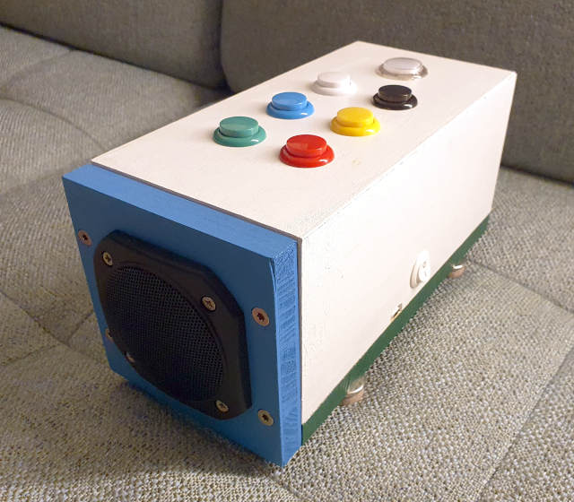
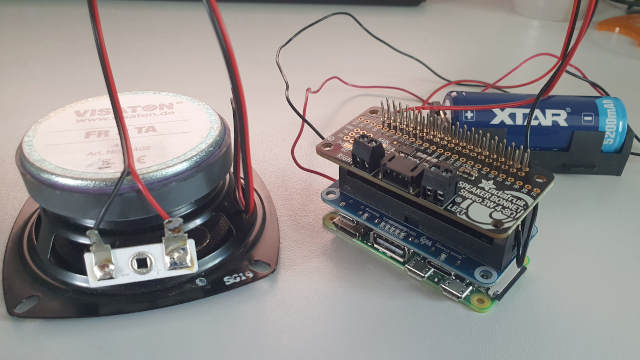

# Windbox
Windbox is a music playing hardware and software based on Raspberry Pi and Python.
It is ment to be used by toddlers and has a very basic control via a few buttons (e.g. "arcade buttons").

## Background
Windbox is a project I created as a baby toy for my son. The initial idea was to create a wooden box that starts a fan on the push of a button to generate some pleasent airflow, hence the name. The airflow soon became dull for my son, and I re-worked the box to be a very basic and simple to use music player.

## Hardware setup
Windbox consists of the following hardware components:
* a Raspberry Pi Zero 2 W: https://www.raspberrypi.com/products/raspberry-pi-zero-2-w
* a Waveshare Li-Ion battery HAT: https://www.waveshare.com/li-ion-battery-hat.htm
* an Adafruit I2S 3W speaker bonnet: https://www.adafruit.com/product/3346
* a 3.7V Li-Ion battery (in my case a type 26650 protected, with mount)
* a 4 Ohm speaker with rougly 3-5W (I chose a Visaton FR 8 TA (10W) because I already had a 8cm cut-out in my wood box from the fan, see above: https://www.visaton.de/de/produkte/chassis/breitband-systeme/fr-8-ta-4-ohm )
* control buttons, e.g. arcade buttons like https://www.berrybase.de/en/mini-arcade-button-24mm
* an On/Off switch, e.g. https://www.berrybase.de/en/wippschalter-rund-1-polig-weiss-on-off?c=2357
* GPIO pins to solder to the Raspberry Pi
* "long" GPIO pins to solder to extend the battery HAT up to the speaker bonnet, e.g. https://www.berrybase.de/en/stacking-header-fuer-raspberry-2x20-40-polig-rm-2-54
* a USB-C extension cable to route out the battery charging
* an audio-suitable cable to connect the speaker to the speaker bonnet (e.g. 2x0.75mm²)
* cables to connect the battery to the battery HAT (the mount on the HAT only fits very small Li-Ion batteries)
* cables to connect the control buttons and the On/Off switch to the GPIO pins
* a (wooden) box with suitable mount options for all hardware

Remark: To connect the On/Off switch to the battery HAT, the on-board switch first needs to be un-soldered and the cables need to be soldered to the respective contacts on the board.
